Babyshark Open-source Hardware Documentation:
==================================

### Bill of Materials

Below are the materials used by the Cal-ITP team to construct the original Baby Shark. These materials are not requirements, rather they are suggestions. So long as the end product meets the product goals and is completed at a low cost, modifications are allowed and encouraged.

Item # | Component | Units  | Unit cost  | Notes
------------ | ------------- | ------------ | ------------- | ------------
1 | [Raspberry Pi 4 GB](https://www.raspberrypi.com/products/raspberry-pi-4-model-b/?variant=raspberry-pi-4-model-b-4gb) | 1 | $59.54 | Open source hardware
2 | [SIM7600A-H 4G HAT](https://www.waveshare.com/product/iot-communication/sim7600a-h-4g-hat.htm) | 1 | $78.58 | Make sure that you are choosing the correct region for this product
3 | [Cooling Fan](https://easycargo.hk/product/raspberry-pi-fan-30x30x7mm-raspberry-pi-cooling-fan-brushless-3-3v-5v-dc-quiet-fan-for-raspberry-pi-3-pi-2-pi-b-retroflag-nespi-case-30mmx30mmx7mm-black-4-pack/) | 1 | $3.60 |
4 | [470 Ohm resistor](https://www.amazon.com/gp/product/B0185FK574) | 1 | $0.84 |
5 | [Ribbon cables 8inch, 4-wire strand](https://www.amazon.com/gp/product/B077N5RLHN?th=1) | 1 | $0.86 |
6 | [Accelerometer](http://www.hiletgo.com/ProductDetail/1949452.html) | 1 | $7.35 |
7 | [SIM Extender](http://eshop.sintech.cn/index.php?main_page=product_info&cPath=52&products_id=1088) | 1 | $19.60 |
8 | [15mm M2 nylon spacer](https://www.amazon.com/100pcs-Standoff-Spacer-Replacement-Female/dp/B07LFKP7ND?th=1) | 4 | $0.16 |
9 | [25mm flathead M2 screw](https://www.amazon.com/MroMax-Machine-Phillips-Stainless-Cabinet/dp/B07YS5Y9W6/ref=sr_1_2?dchild=1&keywords=M2+x+25mm&qid=1628879636&sr=8-2) | 4 | $0.14 |
10 | [5mm flathead M2 screw](https://www.amazon.com/50PCS-Grade-Socket-Oxidation-Screws/dp/B07PP9H29B/ref=sr_1_3?dchild=1&keywords=5mm+flat+head+m2+screw&qid=1628646491&sr=8-3) | 2 | $0.25 |
11 | [4mm flathead M2 screws](https://www.amazon.com/50PCS-Grade-Socket-Oxidation-Screws/dp/B07PM7NMGD/ref=sr_1_11?dchild=1&keywords=4mm+flat+head+m2+screw&qid=1628646565&sr=8-11) | 4 | $0.25 |
12 | [6mm flathead M2 screws](https://www.amazon.com/M2-0-4-Tapping-Stainless-Phillips-Drilling/dp/B093ZRNGF1/ref=sr_1_3?dchild=1&keywords=25mm%2Bflat%2Bhead%2Bm2%2Bscrew&qid=1628646357&sr=8-3&th=1) | 4 | $0.13 |
13 | [1mm heat shrink tubes](https://www.amazon.com/Uxcell-a11110900ux0075-Shrinkable-Shrink-Tubing/dp/B00843KWKS/ref=sr_1_3?dchild=1&keywords=1mm+heat+shrink+tubes&qid=1628646712&sr=8-3) | 0.5 | $0.85 | Units is in feet
14 | [USB-C extender](https://www.cellularizeme.com/product/cellularize-usb-c-extender-adapter/) | 1 | $4.54 |
15 | [M2 nylon washer](https://www.amazon.com/uxcell-Insulating-Washers-Gaskets-Spacers/dp/B01N6B5KJN/ref=sr_1_3?dchild=1&keywords=M2+x+5+x+1mm+Black+Nylon+Flat+washer&qid=1628646949&sr=8-3) | 20 | $0.04 |
16 | [SD card](https://www.amazon.com/SanDisk-SDSQUNS-016G-GN3MN-microSDHC-Everything-Stromboli/dp/B07MR6K8PD) | 1 | $8.62 |
17 | [Raspberry pi power connector](https://www.raspberrypi.com/products/type-c-power-supply/) | 1 | $10.60 | Open source hardware
18 | [uxcell USB 2.0 Type A Male Socket Connector Jack Port](https://www.amazon.com/gp/product/B07QV5P9KT) | 30 | $0.29 |
19 | [WEIJ 20 Pcs Micro USB Male Type B 5-Pin Jack Port Solder Connector](https://www.amazon.com/gp/product/B07Q4J5NKZ) | 20 | $0.35 |
20 | [LED](https://www.amazon.com/gp/product/B01GE4WGTS) | 1 | $0.46 |
| | **Total:** | **$197.54** |

### Pre-Fabrication:
#### LED:

Components include  (numbers correspond to bill of materials above):

*  01 - Raspberry Pi 4 GB
*  04 - 470 Ohm resistor
*  05 - Ribbon cables 8inch, 4-wire strand
*  13 - 1mm heat shrink tubes

To start assembling the LED, go through the following steps:

1. Peel off 2 wires from the bunch of ribbon cables.
2. Cut to 11 cm in length measuring from the female side.
3. Shorten LED leads to 3 and 6 mm respectively, making sure to leave a length difference.
4. Shorten resistor leads to 3 mm on each side
5. Cut 2.5 mm heat shrink tube to size, a couple of mm longer than resistor span
6. Solder resistor to shorter LED lead using flux
6. Strip one wire in strand
7. Hold LED and resistor next to strand so that tip of stripped wire is level with bottom of LED
8. Cut other wire so that its end is level with bottom end of resistor body
9. Strip said wire
10. Flux and tin wire tips
11. Push 2.5 mm heat shrink tube over shorter wire, 1 mm heat shrink tube over longer wire
12. Solder short wire end to open resistor lead using flux
13. Solder longer wire to open LED lead using flux
14. Push heat shrink tubes up against LED
15. Use heat gun to shrink tubes
16. Once you are done with these steps you should have something that looks like this:

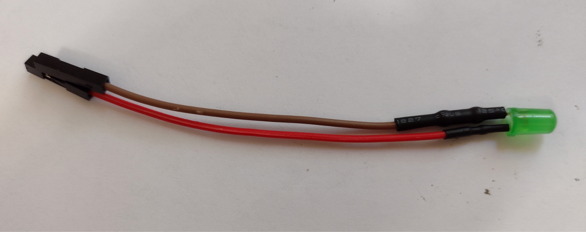

#### Accelerometer:

Components include (numbers correspond to bill of materials above):

* 01 - Raspberry Pi 4 GB
* 05 - Ribbon cables 8inch, 4-wire strand
* 06 - Accelerometer
* 13 - 1mm heat shrink tubes

Notes:

* Wire length = 9 cm
* Be sure to use 1 mm heat shrink tube
* Accelerometer ground (gnd) to pi gnd (6)
* Accelerometer vcc to pi 3v3 (1)
* Accelerometer sda to pi sda (3)
* Accelerometer scl to pi scl (5)
(numbers in parentheses correspond to pins on the Raspberry Pi’s general IO connector.)

1. Divide short ribbon into strands of 4 wires each
2. Remove male ends
3. Strip insulation from individual wires
4. Apply flux and tin to stripped wire tips
5. Push heat shrink tubes over wire tips
6. Hold PCB components down and screw holes facing away
7. Stick tinned ends through two leftmost and two rightmost solder holes on the accelerometer board when it is oriented so that the components face the user and the holes face down.
8. Clamp board into third hand or similar without tinned ends slipping out of holes
9. Prop up wire strand from below to keep ends inserted
10. Flux holes with ends
11. Solder tinned tips to holes
12. Using flush cutters, snip off solder and wire tips protruding past bottom of PCB
13. Re-melt solder in holes for smoother surface
14. Push up heat shrink tubes against PCB and shrink with heat gun

#### USB Connector between Pi and Waveshare:

Components:

* 01 - Raspberry Pi 4 GB
* 02 - SIM7600A-H 4G HAT
* 05 - Ribbon cables 8inch, 4-wire strand
* 13 - 1mm heat shrink tubes ("units" is in feet)

1. Cut ribbon to 13.5 cm length, removing both male and female ends
2. Divide into strands of 4 wires each
3. Peel individual wires apart at each end to about 3 cm
4. Strip insulation from individual wires
5. Flux and tin wire tips
6. Push about 1.25 cm of heat shrink tube over each wire, continuing up as much as the wire allows
7. If necessary, bend USB A pins to be at right angle to connector and parallel to each other
8. Flux and tin pins
9. Starting with a center pin, solder a tinned wire end to each pin
10. Push up heat shrink tubes against pins and apply heat gun to shrink
11. Flux and tin USB micro pins (only one of the pins on the two-pin side needs connecting, refer to diagram above)
12. Attach wires to pins according to diagram above
13. Push up heat shrink tubes against pins and apply heat gun to shrink
14. Check if the cable is working by connecting the Raspberry Pi and the waveshare and running 'microcom -D /dev/ttyUSB2'. At prompt, enter 'at'. If the cable is correctly connected, waveshare will reply with 'OK'.

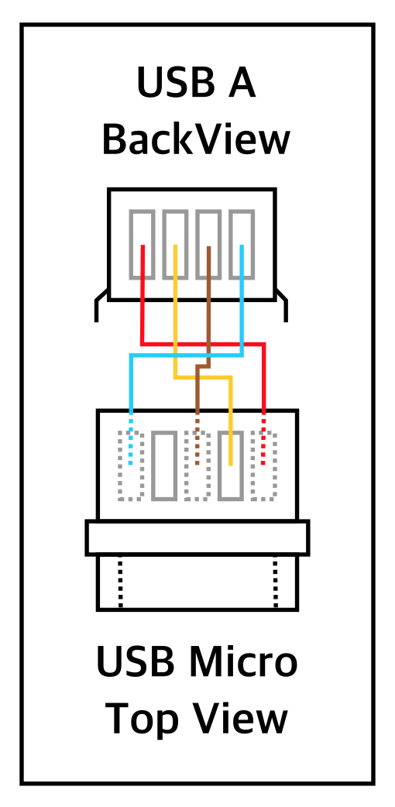
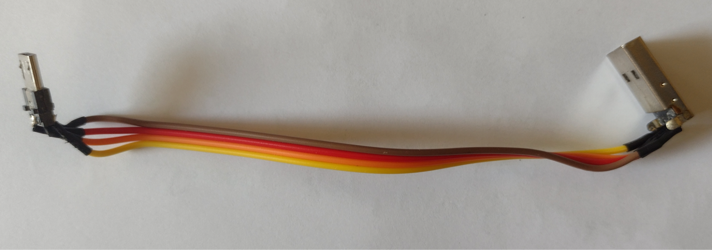
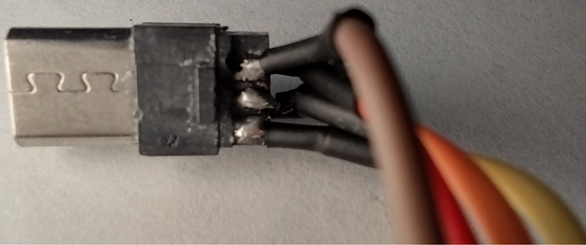
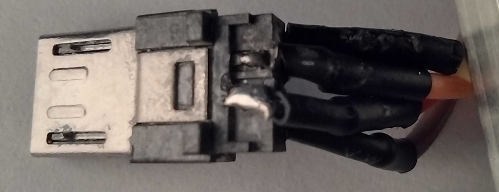

### Assembly - Stage I:

1. Remove waveshare from packaging, take styrofoam protector off GPIO pins and turn board upside down. This is what you should see: 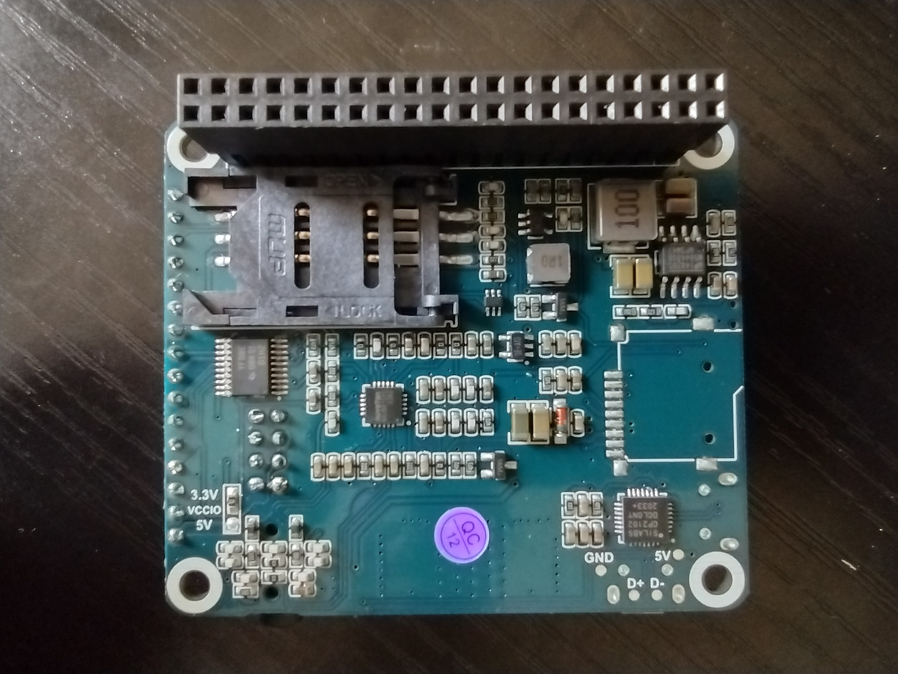
2. Slide sim connector to the right to open:
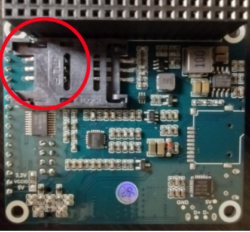
3. Thread male end of sim extender through bracket as shown:
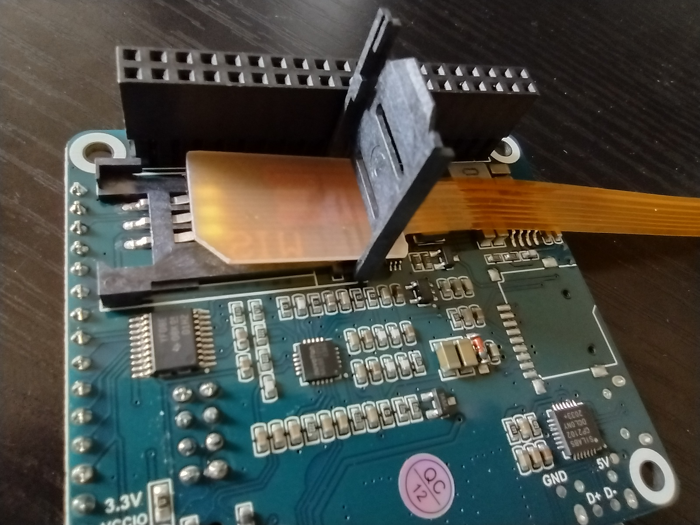
4. Pull male end through further, then feed into bracket as shown:
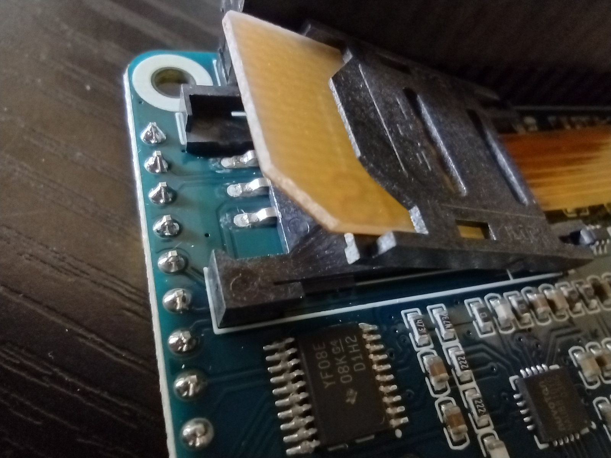
5. Close bracket on connector, making sure that sim male end fits into connector cutouts, then slide top bracket to the left to secure
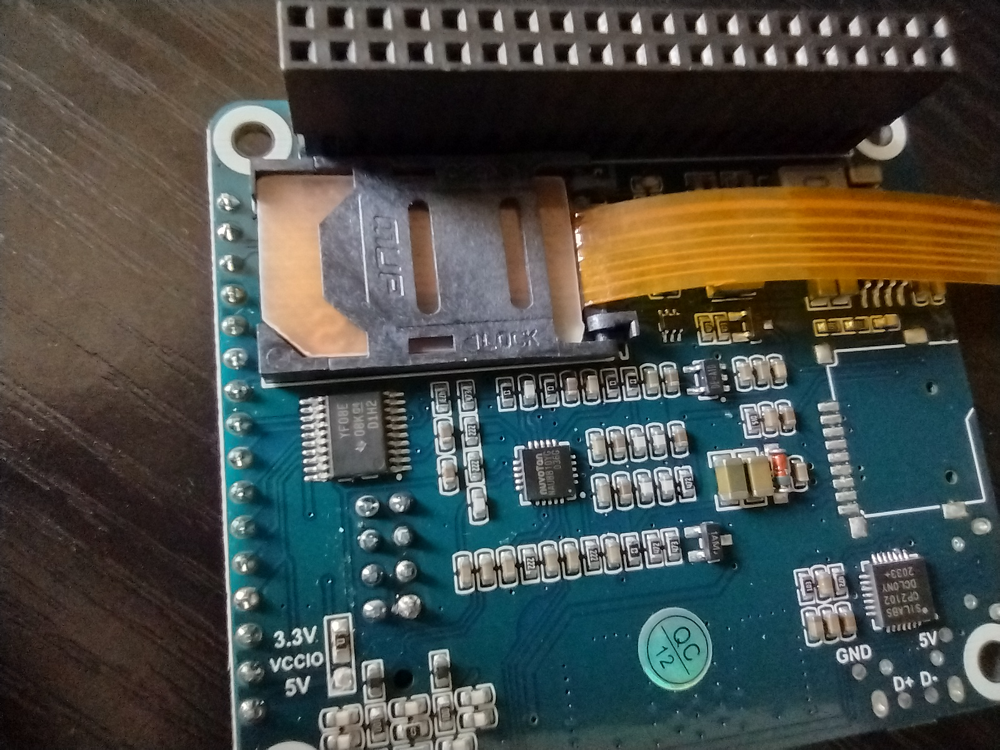
6. Remove pi from packaging, turn upside down and insert micro SD card with OS image into card slot as shown:
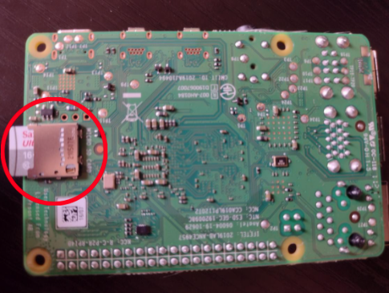
7. Connect pi and Waveshare GPIO pins, being careful to properly align both banks. **Don't insert pins all the way; leave 1mm of space. See step 8.**
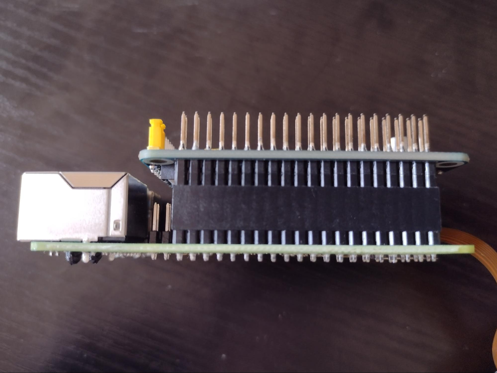
8. Further connect boards using 4 M2 25 mm screws, 8 M2 nylon washers and 4 hex M2 nylon spacers, as shown. Then push GPIO pins in all the way
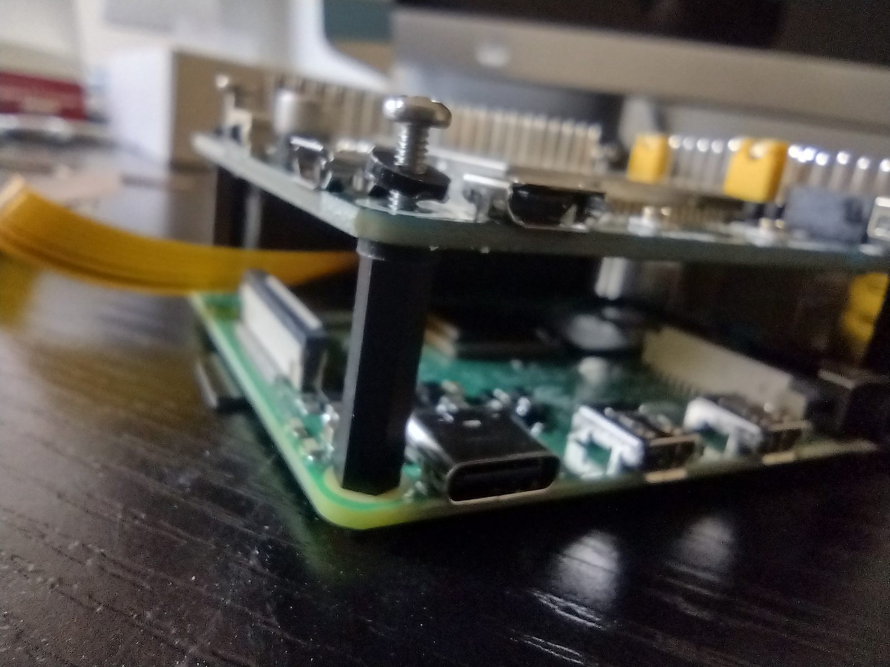
9. Connect LTE cable to board MAIN and GPS cable to board GNSS as shown. There needs to be a clearly audible snap from each connector
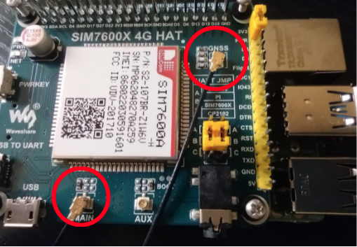
10. Connect Pi and waveshare USB ports through cable as shown. Note that cable may look different from image
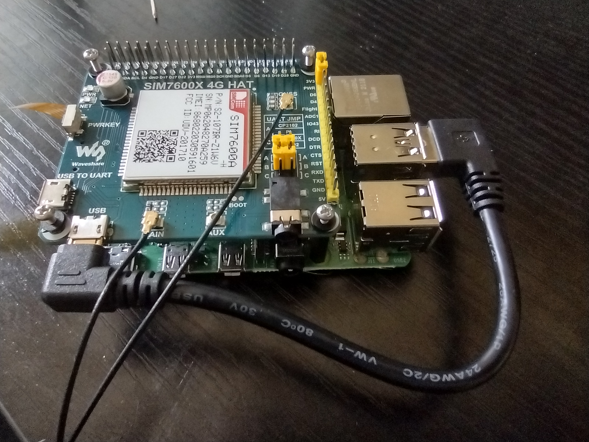
11. Connect LTE and GPS antennas, display, keyboard, mouse and power
12. Boot up pi. There may be a message about resizing the root file system and then the screen may go and stay blank. If that happens, wait a few minutes, then unplug and restart the Pi.
13. Go through the operating system (OS) setup process, make sure to configure a wireless network to join. Setup process may include substantial OS updates.
14. After pi reboots, log in with the password you set, open a terminal window and type tf. After you hit enter, you should see messages about sending GPS updates to the server if everything is set up right.
**NOTE: software set up instructions coming soon.**

### Final Assembly - Stage II:
1. Thread two M2 nuts each onto 2 M2 x 10mm screws. Attach fan to case using top two fan housing screw holes
2. Put an M2 nylon washer each onto 2 M2 x 5mm screws. Attach SIM extender to case using top two extender screw holes
3. Put an M2 nylon washer each onto 2 M2 x 6mm screws. Attach accelerometer to case using top two accelerometer screw holes
4. Attach USB-C extender to case using a glob of Kwik Weld or similar. Roughen plastic housing of extender with a few diagonal serrated knife cuts to provide better grip for the glue.