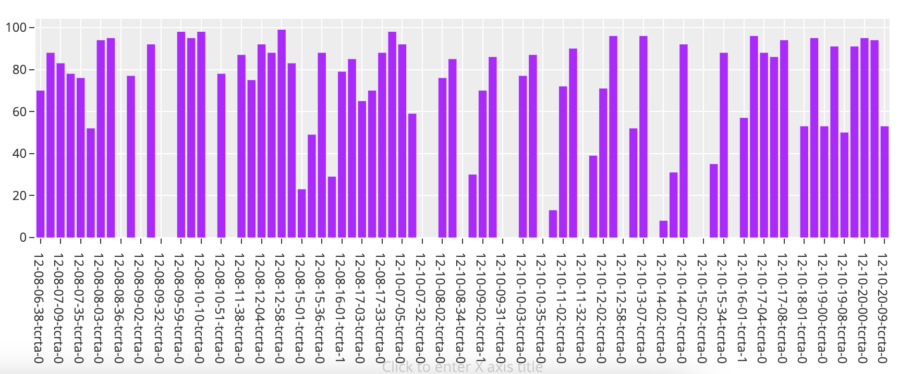
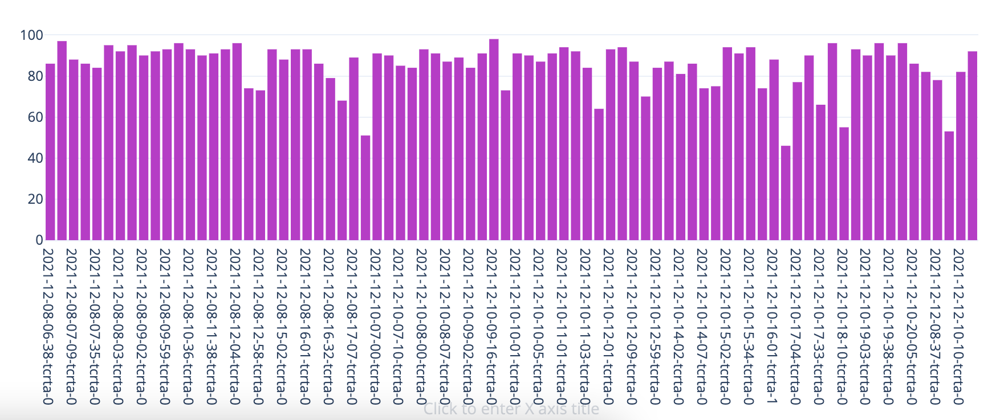
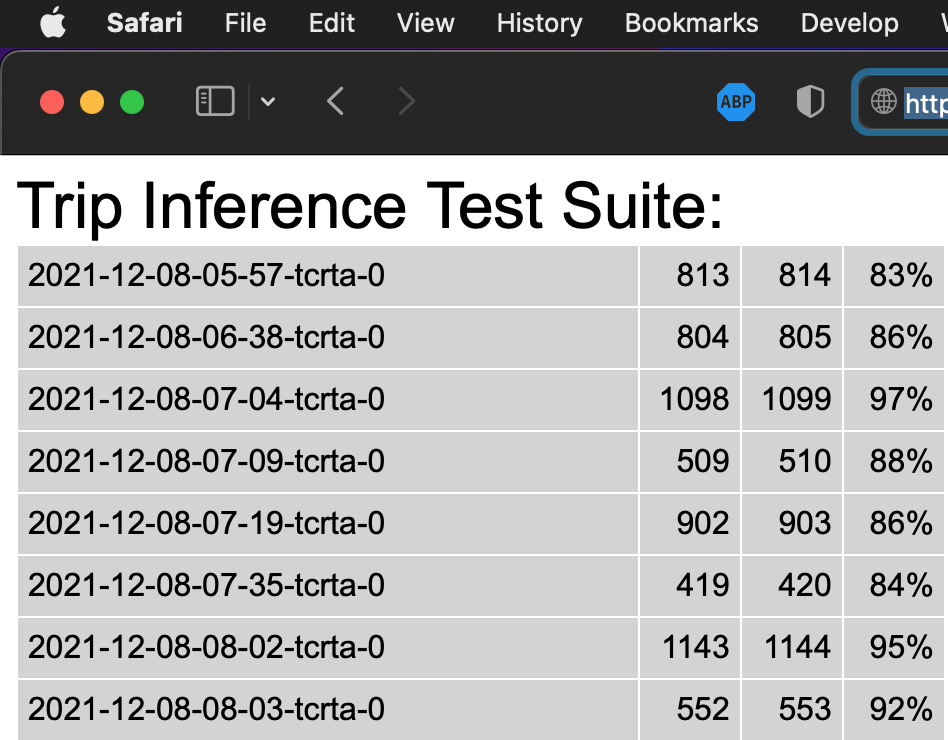

# Trip Inference

Trip Inference is a GRaaS module designed to eliminate most interactions that drivers will have with the system. The module infers the trip a vehicle is currently on by combining data points involving the day of the week, the time of day, and a stream of lat/long updates. Trip Inference utilizes edge computing, which means that computations happen on the client device (phone, tablet, custom hardware like Baby Shark) and not on the server, which greatly improves scalability.

To establish a baseline, and to be able to continually track correctness and performance for Trip Inference, we set up a test suite. The suite comprise some 80-odd test cases, which hold lat/long data and time stamps recorded for actual trips with a Calfornia transit agency (TCRTA) in December of 2021. See the image below for initial Trip Inference numbers.



After some debugging and tuning, we got to the following point.




## Python

Trip Inference was originally implented in python, so that it could run on Baby Sharks. But it also works on the desktop. Run the suite like so:

```
cd $GRAAS_HARDWARE_ROOT # e.g. ~/projects/graas-hardware
python batch-archived-runs.py -d $GRAAS_ROOT/data -o $OUTPUT_FOLDER -g $CACHE_FOLDER -s $GRAAS_ROOT/data/trip-inference-training/gtfs-archive/2022-02-14-tcrta-gtfs.zip
```

The suite will run for a few minutes and then report results.

## Javascript

We ported the original `python` implementation of Trip Inference to `javascript`. This port runs under both `node.js` and in the browser.

### node.js

To run the test suite through node:

```
cd server/app-engine/static
time NODE_PATH=$NODE_PATH node batch-archived-runs.js -d $GRAAS_ROOT/data/trip-inference-training/included/ -o $OUTPUT_FOLDER -g $CACHE_FOLDER -s $GRAAS_ROOT/data/trip-inference-training/gtfs-archive/2022-02-14-tcrta-gtfs.zip | tee log.txt
```

### Browser

Point your browser to a GRaaS server instance, e.g. when running locally `https://127.0.0.1:8080?ti&ti-test`

